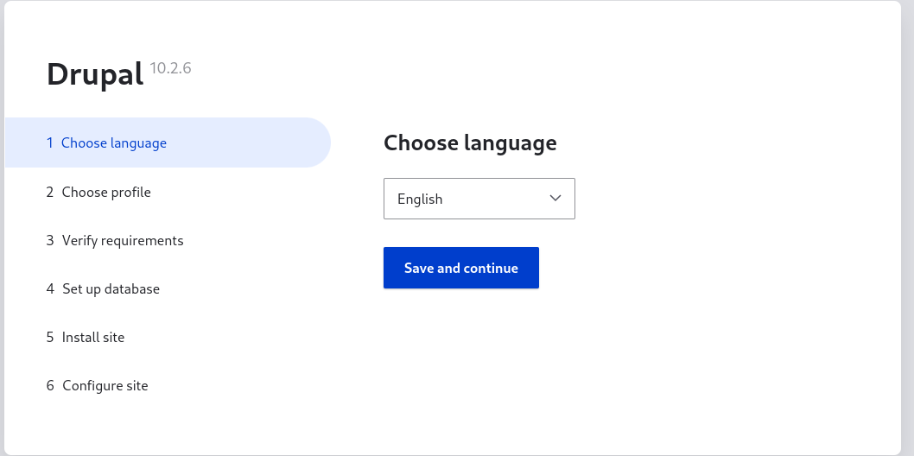
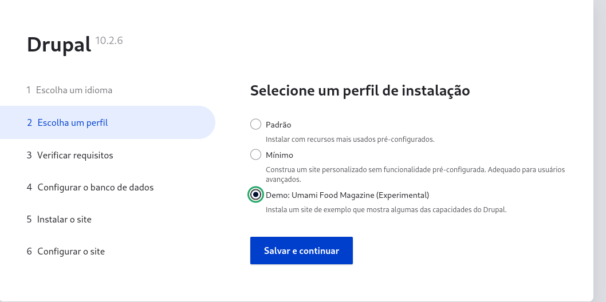
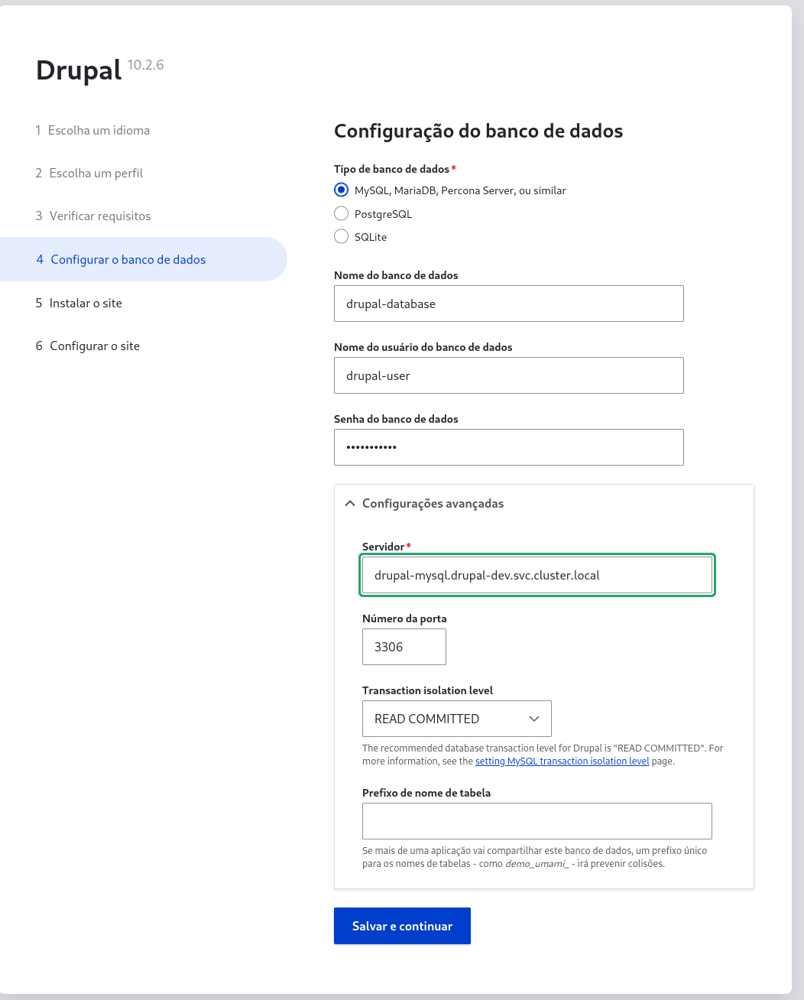
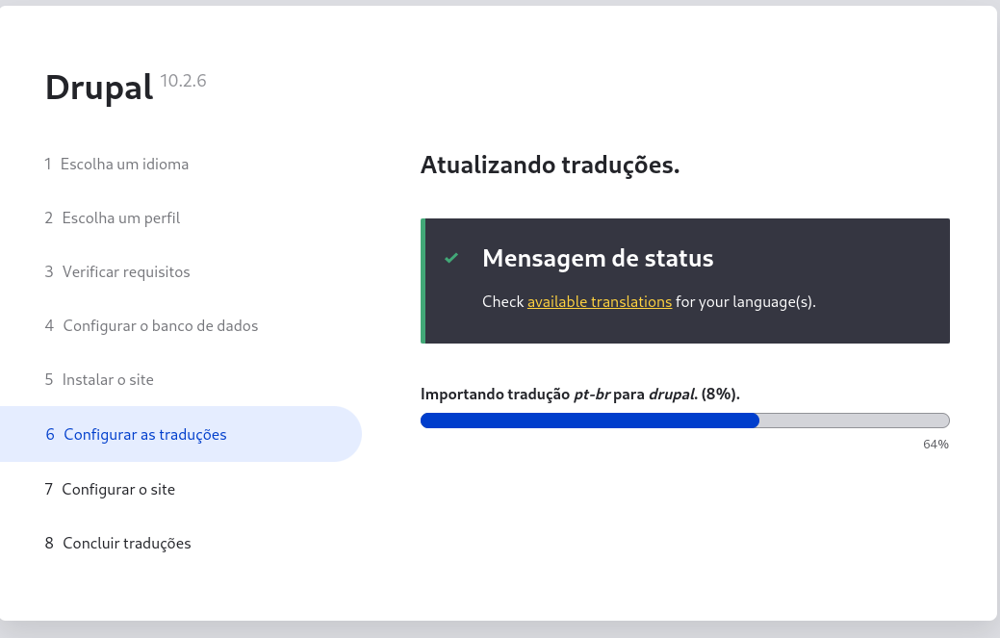
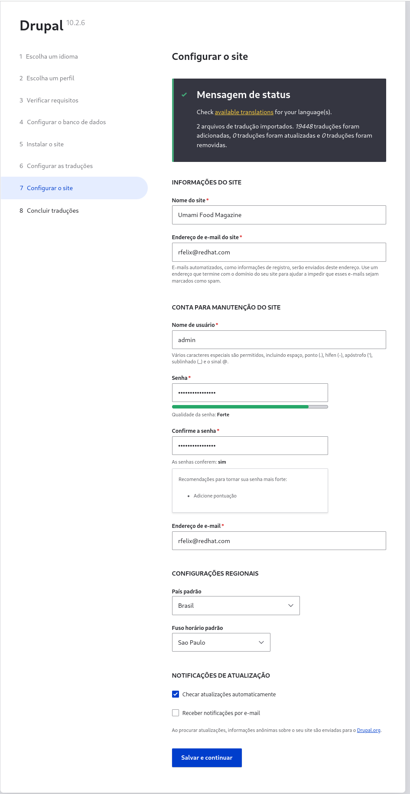
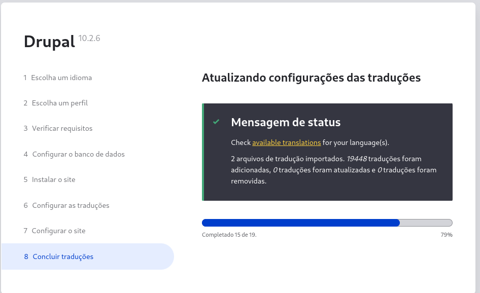
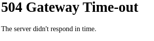
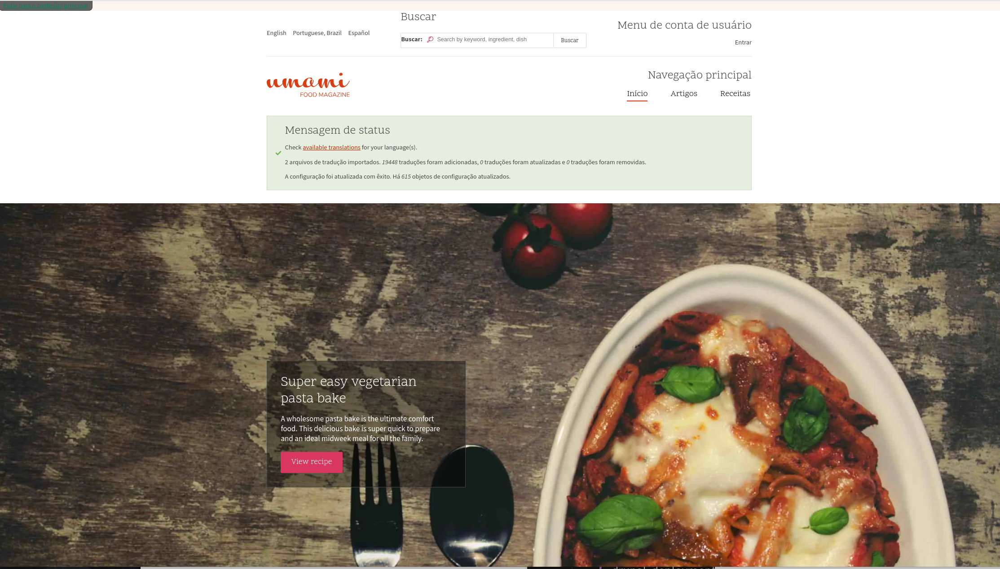

# Exemplo de deploy do Drupal no Openshift 4.15.x
> Considerar com o propósito de demonstração.

# Criar no Openshift
```shell
oc apply -k resources/overlays/dev
```

# Remover o que foi instalado
```shell
oc delete -k resources/overlays/dev
```

0/1 nodes are available: pod has unbound immediate PersistentVolumeClaims. preemption: 0/1 nodes are available: 1 Preemption is not helpful for scheduling..

# Documents
















# Reference
* https://hub.docker.com/_/drupal
* https://hub.docker.com/_/mysql

* https://shubhamksawant.medium.com/deploy-drupal-app-on-kubernetes-a56244e514ca
* https://examples.openshift.pub/deploy/scc-anyuid/


# Troubleshooting
```shell
Warning: would violate PodSecurity "restricted:v1.24": allowPrivilegeEscalation != false (container "drupal" must set securityContext.allowPrivilegeEscalation=false), unrestricted capabilities (container "drupal" must set securityContext.capabilities.drop=["ALL"]), runAsNonRoot != true (pod or container "drupal" must set securityContext.runAsNonRoot=true), runAsUser=0 (container "drupal" must not set runAsUser=0), seccompProfile (pod or container "drupal" must set securityContext.seccompProfile.type to "RuntimeDefault" or "Localhost")
```

```shell
message: 'pods "drupal-56686ff69d-" is forbidden: unable to validate against any security context constraint: [provider anyuid: .spec.securityContext.seLinuxOptions.level: Invalid value: "s0:c25,c10": must be s0:c26,c5, provider anyuid: .containers[0].seLinuxOptions.level: Invalid value: "s0:c25,c10": must be s0:c26,c5, provider restricted-v2: .spec.securityContext.fsGroup: Invalid value: []int64{0}: 0 is not an allowed group, provider restricted-v2: .spec.securityContext.seLinuxOptions.level: Invalid value: "s0:c25,c10": must be s0:c26,c5, provider restricted-v2: .containers[0].runAsUser: Invalid value: 0: must be in the ranges: [1000660000, 1000669999], provider restricted-v2: .containers[0].seLinuxOptions.level: Invalid value: "s0:c25,c10": must be s0:c26,c5, provider "restricted": Forbidden: not usable by user or serviceaccount, provider "nonroot-v2": Forbidden: not usable by user or serviceaccount, provider "nonroot": Forbidden: not usable by user or serviceaccount, provider hostmount-anyuid: .spec.securityContext.seLinuxOptions.level: Invalid value: "s0:c25,c10": must be s0:c26,c5, provider hostmount-anyuid: .containers[0].seLinuxOptions.level: Invalid value: "s0:c25,c10": must be s0:c26,c5, provider "machine-api-termination-handler": Forbidden: not usable by user or serviceaccount, provider "hostnetwork-v2": Forbidden: not usable by user or serviceaccount, provider "hostnetwork": Forbidden: not usable by user or serviceaccount, provider "hostaccess": Forbidden: not usable by user or serviceaccount, provider "hostpath-provisioner": Forbidden: not usable by user or serviceaccount, provider "privileged": Forbidden: not usable by user or serviceaccount]'
```
```shell
message: 'pods "drupal-56686ff69d-" is forbidden: unable to validate against any security context constraint: [provider anyuid: .spec.securityContext.seLinuxOptions.level: Invalid value: "s0:c25,c10": must be s0:c26,c5, provider anyuid: .containers[0].seLinuxOptions.level: Invalid value: "s0:c25,c10": must be s0:c26,c5, provider restricted-v2: .spec.securityContext.fsGroup: Invalid value: []int64{0}: 0 is not an allowed group, provider restricted-v2: .spec.securityContext.seLinuxOptions.level: Invalid value: "s0:c25,c10": must be s0:c26,c5, provider restricted-v2: .containers[0].runAsUser: Invalid value: 0: must be in the ranges: [1000660000, 1000669999], provider restricted-v2: .containers[0].seLinuxOptions.level: Invalid value: "s0:c25,c10": must be s0:c26,c5, provider "restricted": Forbidden: not usable by user or serviceaccount, provider "nonroot-v2": Forbidden: not usable by user or serviceaccount, provider "nonroot": Forbidden: not usable by user or serviceaccount, provider hostmount-anyuid: .spec.securityContext.seLinuxOptions.level: Invalid value: "s0:c25,c10": must be s0:c26,c5, provider hostmount-anyuid: .containers[0].seLinuxOptions.level: Invalid value: "s0:c25,c10": must be s0:c26,c5, provider "machine-api-termination-handler": Forbidden: not usable by user or serviceaccount, provider "hostnetwork-v2": Forbidden: not usable by user or serviceaccount, provider "hostnetwork": Forbidden: not usable by user or serviceaccount, provider "hostaccess": Forbidden: not usable by user or serviceaccount, provider "hostpath-provisioner": Forbidden: not usable by user or serviceaccount, provider "privileged": Forbidden: not usable by user or serviceaccount]'
```
